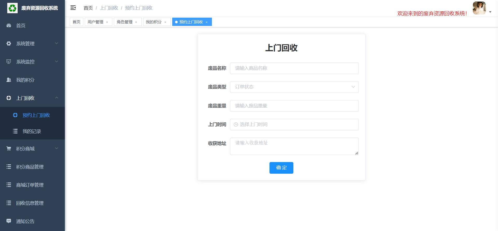
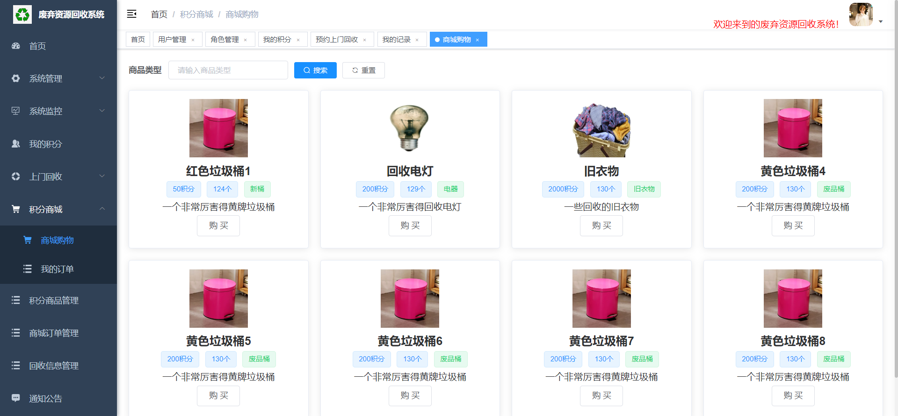

# 废弃资源回收管理系统

####  技术支持

> 更详细的源代码，可以联系
> V：wangjs_aline

####  技术选型

> SpringBoot+Vue+Mysql

####  访问地址

> http://localhost:8080/login?redirect=%2Findex
>
> admin / admin123

#### 功能预览

##### 登录页面

 

##### 首页

 

##### 用户管理

##### 角色管理

 

##### 我的积分

 

##### 预约上门回收

 

 

##### 积分商城

 

##### 【管理员】积分商品管理

 

##### 【管理员】商城订单管理

 

##### 【管理员】回收信息管理

##### 通知公告

 